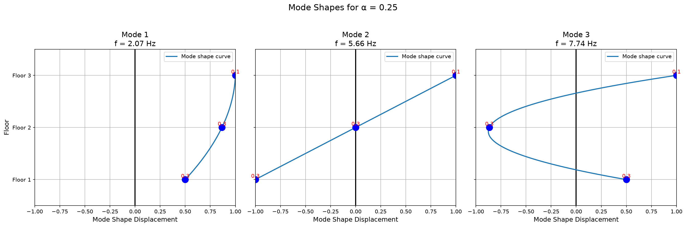
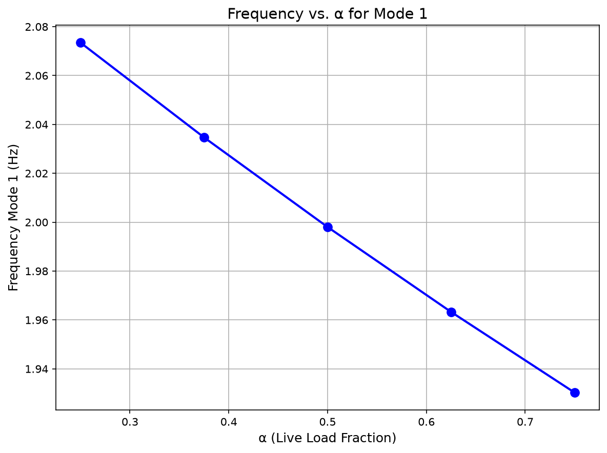

# Corrosion-Aware Structural Health Monitoring

**Corrosion-Aware Structural Health Monitoring via Modal Analysis of a 3-Story Shear Frame**


This project presents a Python-based structural health monitoring (SHM) workflow for a 3-story shear frame, with a focus on how **live-load variation** and **corrosion-induced section loss** affect modal properties. The implementation uses classical structural dynamics and numerical linear algebra to evaluate changes in **mass**, **stiffness**, **natural frequencies**, and **mode shapes**.

The project was developed in Python using **NumPy**, **SciPy**, and **Matplotlib**, and is organized as a computational study suitable for structural analysis, condition assessment, and damage-sensitive modal investigation.

## Problem Statement

The frame is a steel building modeled as a 3-DOF shear building with lumped floor masses. Based on as-built properties:

- All columns are **W14×120** sections, oriented to bend about their strong axis.
- Lumped floor masses: `m1 = m2 = 0.24 kip·s²/in`, `m3 = 0.12 kip·s²/in`.
- Live-load-to-dead-load ratio of `1:3`; no load factors are applied.

Three tasks are addressed:

1. **Live-load variability** — compute the natural frequencies and mode shapes when the live-load portion varies between **25% and 75%** of its specified value.
2. **Corrosion** — the outer flange of the right column in Story 1 corrodes at **0.25 mm/year**; recompute the modal properties after **20 years** of active corrosion.
3. **Structural health monitoring** — based on Tasks 1 and 2, discuss whether modal-analysis-based SHM is a useful tool for detecting corrosion progression in this frame.

The full problem statement is included in [`ReadMe_Structural Dynamics.pdf`](./ReadMe_Structural%20Dynamics.pdf).

## Key Features

- **Modal analysis of a 3-story shear frame** using the generalized eigenvalue problem `K φ = ω² M φ`
- **Live-load sensitivity analysis** across the 25–75% range
- **Corrosion-aware section-property update** (flange thickness, centroid, moment of inertia)
- **Mass and stiffness matrix formulation** for the shear-building model
- **Healthy vs. corroded structural comparison**
- **Visualization** of frequencies and mode shapes
- **Verification-oriented workflow**: Task 1 mode shapes/frequencies are checked against Tüken (2019), and the Task 2 section properties are checked against the published W14×120 values

## Results

### Task 1 — Live-load variability (healthy structure)

The mode shapes are the classical shear-building shapes and are essentially independent of the live-load fraction `α`, while the natural frequencies decrease as the live-load (and therefore the floor mass) increases.

<p align="center">
  
</p>

<p align="center">
  
</p>

| α (live-load fraction) | f₁ (Hz) | f₂ (Hz) | f₃ (Hz) |
|:----------------------:|:-------:|:-------:|:-------:|
| 0.25 | 2.073 | 5.665 | 7.738 |
| 0.38 | 2.035 | 5.559 | 7.594 |
| 0.50 | 1.998 | 5.459 | 7.457 |
| 0.62 | 1.963 | 5.364 | 7.327 |
| 0.75 | 1.930 | 5.274 | 7.204 |

Across the full 25–75% live-load range, the natural frequencies vary by roughly **7%**, quantifying how everyday load variability alone shifts the frame's dynamic signature.

### Task 2 — Corrosion after 20 years

After 20 years at 0.25 mm/year, the corroded flange loses **0.197 in** of thickness, reducing the affected column's section properties:

| Property | Healthy (W14×120) | Corroded (Story-1 right column) |
|---|:---:|:---:|
| Corroded flange thickness | 0.94 in | 0.743 in |
| Centroid from bottom | 7.25 in | 6.699 in |
| Moment of inertia `I` | 1380 in⁴ | 1247 in⁴ (**−9.6%**) |

These updated section properties are fed back into the stiffness matrix to reassess the frame's modal response.

### Task 3 — SHM interpretation

The healthy and corroded states are compared through their mass matrices, stiffness matrices, natural frequencies, and mode shapes to assess whether modal-analysis-based SHM can flag corrosion progression for this frame. The full comparison — matrices, frequencies, and mode-shape overlays — is generated in [`main.ipynb`](./main.ipynb).

## Methodology

The notebook is organized into three parts:

1. **Live-load variation** — the mass matrix is updated for live-load fractions in `[0.25, 0.75]`, and the generalized eigenvalue problem is solved with `scipy.linalg.eigh` to obtain circular frequencies, natural frequencies, and mode shapes.
2. **Corrosion effects** — corrosion is introduced by reducing the corroded flange thickness; the workflow recomputes the section geometry, centroid, moment of inertia, and the mass lost to corrosion, then updates the structural model.
3. **SHM comparison** — the healthy and corroded states are compared to highlight how damage affects the mass matrix, stiffness matrix, modal frequencies, and mode shapes.

## Getting Started

### Requirements

- Python 3.8+
- NumPy, SciPy, Matplotlib (see [`requirements.txt`](./requirements.txt))

### Installation

```bash
git clone https://github.com/samirhosein/structural-health-monitoring-corrsion-aware.git
cd structural-health-monitoring-corrsion-aware
pip install -r requirements.txt
```

### Running the analysis

Open the notebook and run the cells in order:

```bash
jupyter notebook main.ipynb
```

> **Note:** the notebook is interactive. When you run the analysis cells, you will be prompted:
> *"Do you want to see the verification result (say yes) or the result of the question (say no)?"*
> - Answer **`no`** to compute the actual task results.
> - Answer **`yes`** to run the verification/validation cases (Task 1 against Tüken (2019); Task 2 against the published W14×120 section properties).

## Repository Structure

```text
structural-health-monitoring-corrsion-aware/
├── main.ipynb                        # Full analysis: Tasks 1–3
├── ReadMe_Structural Dynamics.pdf    # Problem statement
├── figures/                          # Figures used in this README
│   ├── mode_shapes.png
│   └── frequency_vs_liveload.png
├── requirements.txt                  # Python dependencies
├── CITATION.cff                      # Citation metadata
├── LICENSE                           # MIT License
└── README.md
```

## Reference

The Task 1 modal properties are verified against:

> Tüken, A. (2019). *Dynamic Response Analysis of a 3-story shear frame subjected to harmonic loading: An analytical approach.* Uludağ University Journal of the Faculty of Engineering, 24(2), 725–734.

## Citation

If you use this repository, please cite it using the metadata in [`CITATION.cff`](./CITATION.cff), or:

> Moayyedi, A. *Corrosion-Aware Structural Health Monitoring via Modal Analysis of a 3-Story Shear Frame.* GitHub repository.

## License

This project is licensed under the terms of the [MIT License](./LICENSE).
